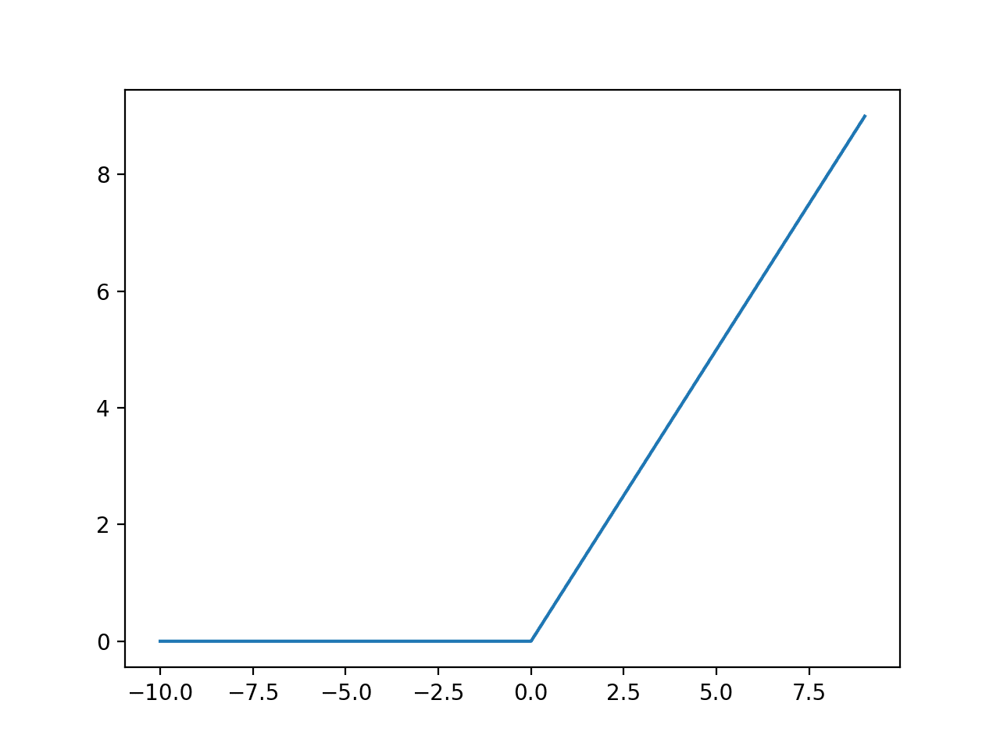

11 Jul, 2024 #11.1.2
## 1.Sigmoid
### 1.1 Function Def:
$$
\sigma(z) = \frac {1}{1 + e^{-z}}
$$

### Drawbacks:
The Sigmoid Function saturates(flattens out) for large positive and large negative values. As a result, the layers don't learn anything and keeps spitting out 0s. 

They are the culprit of Vanishing/Exploding Gradients problem.
## 2.ReLU: Rectified Linear Unit
### 2.1 Function Def

$$
ReLU(z) =
\begin{cases}
z & \text{if {z > 0}} \\
0 & \text {if {z $\le$ 0}}
\end{cases}
$$

Unlike the sigmoid activation function, ReLU doesn't saturate for large positive values.
### 2.1.Drawbacks
#### 2.1.1 Dying ReLUs
It outputs 0 for any value of Input is negative. During the training, some neurons die, i.e, they don't output anything than zero. This can happen due to *large learning rate*.
For a neuron to die, it's weights must be tweaked in a way that the input of ReLU function(the weighted sum of neuron's inputs + bias term) is ==negative== for all instances in the training set.

## 3.Leaky ReLU

### 3.1 Function Def
$$LeakyReLU_{\alpha}(z) = max(\alpha z, z)$$

This is a variant of ReLU. Which doesn't saturate for negative values. 

The hyperparameter $\alpha$ determines how much the function "leaks": $\alpha$ is the slope of the function for z<0.

> LeakyReLU performs better than ReLU with a $\alpha = 0.2$ 

There are other variants of ReLU such as Randomized ReLU(RReLU), Paratameterized ReLU(PReLU). ReLU and it's variants suffer from the fact that, they are not smooth functions: their derivatives abruptly change at $z = 0$. 
## Smooth Variants of ReLU: ELU, SELU
## 4. ELU: Exponential Linear Unit

### 4.1 Function Def:

$$
ELU_{\alpha}(z) = 
\begin{cases}
\alpha(exp(z) - 1) & \text{if $z$ $\lt$ 0} \\
z & \text{if $z$ $\ge$ 0}
\end{cases}
$$

-> Outperforms all the other variants of ReLU
-> Training time was reduced.
-> The NN performed better on test set.

### 4.2 Drawbacks
-> Slower to compute because of the exponential function

## 5. SELU: Scaled Exponential Linear Unit
### 5.1 Function Def:
$$
SELU(z) = 1.05*ELU_{1.67}(z)
$$
A scaled version of ELU (about 1.05 times ELU with $\alpha \approx1.67$) 

## 6. Softmax Activation
### 6.1 Function Def
$$
(\hat{p}_k) = \sigma(\mathbf{s(x)})_k = \frac {exp(s_k(\mathbf{x}))}{\sum_{j=1}^K exp(s_j (\mathbf{x}))} \tag{6.1}\label{}
$$

In this equation:
- $K$ is the number of classes.
- Softmax score for class k

$$
s_k(\mathbf{x}) = (\boldsymbol{\theta}^k)^T \mathbf{x}
$$

Each class has its own dedicated parameter vector $\boldsymbol{\theta}^k$. All these vectors are typically stores as rows in a parameter matrix $\Uptheta$

- $ \mathbf{s(x)} $ is a vector containing the scores of each class fot he instance $\mathbf{x}$
- $\sigma(\mathbf{s(x)})_k$ is the estimated probability that the instance $\mathbf{x}$ belongs to class $k$, given the scores of each class for that instance. 
- $exp: e$

$ \eqref{6.1} \text{ can be even written as} $

$$

\sigma(\mathbf{z})_i = \frac {e^{z_i}}{\sum_{j=1}^K e^{z_j}}

$$
$ \mathbf{z} = (z1,z2,...,z_K)\in \Bbb{R}^K $

## 7. Softplus
$$
Softplus(x) = \frac {1}{\beta} * log(1 + e^{(\beta * x)}) 
$$
$$
Softplus(x) = \frac {1}{\beta} * log(1 + e^{(\beta * x)}) $$
## Help: When to use Which Activation Function

| Activation Function | When                     |
| ------------------- | ------------------------ |
| ReLU                | For all the simple tasks |
| Swish               | For complex tasks        |
| Leaky ReLU          | Runtime Latency          |
| SELU                | Deep MLP                 |

